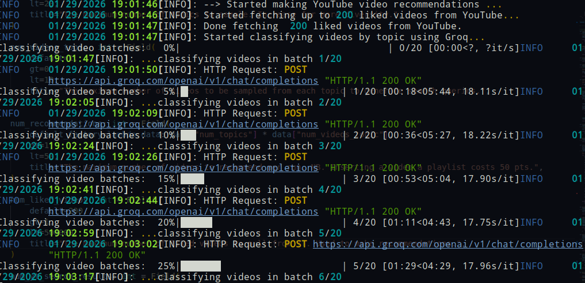
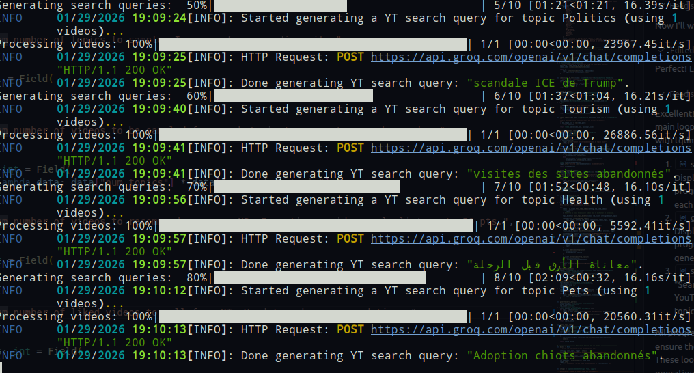

# 🎬 YouTube LLM-Based Video Recommender

> **Discover fresh, personalized YouTube videos powered by artificial intelligence**

A sophisticated recommendation system that analyzes your liked videos, intelligently classifies them by topic, and generates creative search queries to help you discover new content—all while respecting your preferences.

---

## ✨ Features

- 🤖 **AI-Powered Classification** - Uses Groq LLM to intelligently categorize your liked videos by topic
- 🔍 **Smart Search Generation** - Generates creative, multi-language YouTube search queries based on your video preferences
- 🎯 **Topic-Based Discovery** - Samples diverse topics from your likes to ensure varied recommendations
- 📊 **Progress Tracking** - Visual progress bars for all long-running operations (batch processing, API calls, video operations)
- 🔐 **Secure Authentication** - OAuth 2.0 integration with YouTube Data API for safe credential handling
- 🛡️ **Channel Filtering** - Exclude specific channels from recommendations
- 📅 **Automatic Playlist Management** - Maintains a curated "LLM Recommendations" playlist
- 🌍 **Multilingual Support** - Generate search queries in multiple languages
- ⚡ **Rate-Limiting Aware** - Respects YouTube API quotas with configurable delays

---

## 🚀 Quick Start

### 1. Prerequisites

- **Python** ≥ 3.10
- **Git** with SSH configured
- **Poetry** package manager
- **Google Cloud Account** (free tier supported)

### 2. Google Cloud Setup

1. Go to [Google Cloud Console](https://console.cloud.google.com/) and create a new project
2. Enable this API:
   - YouTube Data API v3
3. Create OAuth 2.0 credentials (Desktop app) and download the JSON
4. Create an API key for the Generative AI API

### 3. Installation

```bash
# Clone the repository
git clone git@github.com:skanderk/yt-videos-recommender.git
cd yt-videos-recommender

# Copy and configure environment variables
cp .env.example .env

# Edit .env with your credentials:
# - GOOGLE_API_KEY: Your Google API key
# - OAUTH_CLIENT_ID: OAuth client ID
# - OAUTH_CLIENT_SECRET: OAuth client secret  
# - YT_RECOMMENDATIONS_PLAYLIST_ID: Target playlist ID
# - GROQ_API_KEY: Groq API key for LLM

# Install dependencies
poetry install
```

### 4. First Run

```bash
poetry run python recommend-yt-videos.py
```

On first run, you'll be prompted to authorize the app via OAuth. A browser window will open—simply grant access to your YouTube account.

---

## 📋 How It Works

The recommender follows a 6-step workflow to discover new videos:

```
┌─────────────────────────────────────────────────────────────┐
│ 1. FETCH LIKED VIDEOS                                       │
│    Pull your liked videos from YouTube                      │
└────────────────────┬────────────────────────────────────────┘
                     │
┌────────────────────▼────────────────────────────────────────┐
│ 2. CLASSIFY BY TOPIC                                        │
│    Use LLM to categorize each video into topics             │
└────────────────────┬────────────────────────────────────────┘
                     │
┌────────────────────▼────────────────────────────────────────┐
│ 3. SAMPLE DIVERSE TOPICS                                    │
│    Randomly select topics for variety                       │
└────────────────────┬────────────────────────────────────────┘
                     │
┌────────────────────▼────────────────────────────────────────┐
│ 4. GENERATE SEARCH QUERIES                                  │
│    Create creative queries from sampled videos (LLM)        │
└────────────────────┬────────────────────────────────────────┘
                     │
┌────────────────────▼────────────────────────────────────────┐
│ 5. SEARCH YOUTUBE                                           │
│    Find videos matching generated queries                   │
└────────────────────┬────────────────────────────────────────┘
                     │
┌────────────────────▼────────────────────────────────────────┐
│ 6. ADD TO PLAYLIST                                          │
│    Add selected videos to "LLM Recommendations" playlist     │
└─────────────────────────────────────────────────────────────┘
```

---

## ⚙️ Configuration

Customize the recommender by editing settings in `recommend-yt-videos.py`:

```python
class RecommenderSettings(BaseSettings):
    num_topics: int = 10                      # Topics to sample
    num_videos_topic: int = 1                 # Videos per topic
    num_recommendations: int = 10             # Total recommendations
    num_liked_videos: int = 100               # Liked videos to analyze
    target_languages: list[str] = ["english", "french", "arabic"]
    default_topics: list[str] = [             # Available topics
        "Business", "Food", "Gaming", "Health",
        "Movies", "Music", "Science", "Technology", ...
    ]
```

---

## 📦 Project Structure

```
├── recommend-yt-videos.py      # Main entry point & orchestration
├── youtube_client.py           # YouTube Data API wrapper
├── llm_client.py               # LLM API wrapper (Groq)
├── llm_prompts.py              # Prompts for LLM tasks
├── models.py                   # Pydantic data models
├── utils.py                    # Utility functions
├── google_oauth_client.py      # OAuth 2.0 authentication
├── type_aliases.py             # Type definitions
├── pyproject.toml              # Python dependencies
└── README.md                   # This file
```

---

## 🔧 Advanced Usage

### Running on a Schedule

Use cron to run the recommender daily:

```bash
# Edit crontab
crontab -e

# Add this line (runs daily at 9 AM)
0 9 * * * cd ~/path/to/yt-videos-recommender && poetry run python recommend-yt-videos.py
```

### Adjusting LLM Settings

Configure the LLM behavior in `recommend-yt-videos.py`:

```python
def create_llm_config():
    return YtVideoRecommenderLlmConfig(
        api_key=os.environ["GROQ_API_KEY"],
        model="mixtral-8x7b-32768",          # LLM model
        classify_videos_batch_size=10,       # Videos per batch
        politeness_delay_sec=2,              # Delay between API calls
    )
```

### Environment Variables

Create a `.env` file with:

```env
GOOGLE_API_KEY=your_google_api_key
OAUTH_CLIENT_ID=your_oauth_client_id
OAUTH_CLIENT_SECRET=your_oauth_client_secret
YT_RECOMMENDATIONS_PLAYLIST_ID=your_playlist_id
GROQ_API_KEY=your_groq_api_key
```

---

## 🖼️ Screenshots

### Execution Trace - Video Classification & Analysis



The first screenshot shows the video classification phase with:
- Progress bars tracking batch processing of liked videos
- LLM classification of videos into semantic topics
- Real-time batch completion indicators


### Execution Trace - Search Generation & Playlist Operations



The second screenshot demonstrates the search and playlist phase with:
- Progress indicators for search query generation per topic
- Real-time YouTube search operations
- Video addition to playlist with progress tracking
- Automatic cleanup of old recommendations


## 🛠️ Tech Stack

- **Language** Python ≥ 3.10
- **LLM** Groq (Fast LLM inference)
- **APIs** YouTube Data API v3, Google Generative AI
- **Package Manager** Poetry
- **Progress Tracking** tqdm
- **Logging** Rich
- **Data Validation** Pydantic
- **Authentication** OAuth 2.0

---

## 📖 How to Use

1. **Authenticate** - Run the script once to authenticate with YouTube via OAuth
2. **Wait** - The first run will:
   - Fetch your liked videos (default: last 100)
   - Classify them using the LLM (with progress bars)
   - Generate search queries (with progress bars)
   - Search YouTube for new videos
   - Add recommendations to your "LLM Recommendations" playlist
3. **Discover** - Check your "LLM Recommendations" playlist for new videos!
4. **Schedule** (Optional) - Set up a daily cron job to get new recommendations automatically

---

## ⚠️ Important Notes

- **API Quotas** - YouTube Data API has daily quotas. The recommender respects these limits
- **Rate Limiting** - Configured with politeness delays to avoid hitting API rate limits
- **First Run** - May take several minutes depending on your number of liked videos
- **Authentication** - Credentials are stored locally in `token.json` (never committed to git)

---

## 🤝 Contributing

Contributions are welcome! Please feel free to:
- Report bugs via GitHub Issues
- Suggest features or improvements
- Submit pull requests

---

## 📝 License

Apache License 2.0 - See [LICENSE](LICENSE) file for details

---

## 👤 Author

**Skander Kort**  
[Website](https://skanderkort.com) | [GitHub](https://github.com/skanderk)

---

## 🙏 Acknowledgments

- YouTube Data API v3 for video data access
- Groq for fast, open-source LLM inference
- The Python community for excellent libraries like Pydantic, Poetry, and tqdm

---

## ⚖️ Disclaimer

This tool is provided as-is for personal use. Ensure compliance with YouTube's Terms of Service and API usage policies when using this tool. The author is not affiliated with Google or YouTube.
